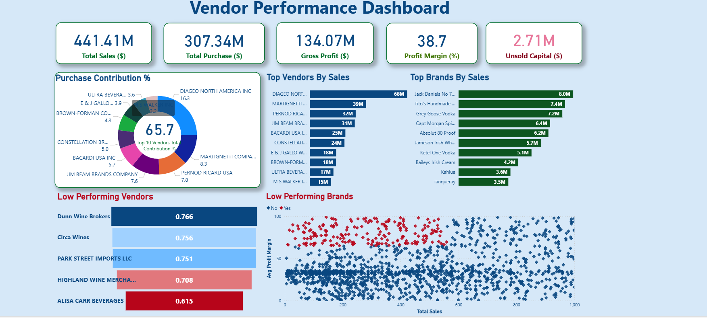

# Vendor Performance Analysis

 ## 🔗 Live Dashboard

Explore the fully interactive dashboard:

• [View Dashboard](https://app.powerbi.com/view?r=eyJrIjoiNmUxYzdhMTktNWE4Mi00YTBlLWJkMDktYjA2YzBiYWRlZThlIiwidCI6ImM2ZTU0OWIzLTVmNDUtNDAzMi1hYWU5LWQ0MjQ0ZGM1YjJjNCJ9)

---

---

## The Business Problem

A retail business is only as strong as its supplier relationships. But most companies have no syste
way of knowing which vendors are actually profitable, which ones are creating inventory risk, and w
bulk purchasing is genuinely saving money or just tying up capital in slow-moving stock.

This project was built to answer exactly those questions. Using real retail inventory and sales dat
spanning multiple vendors across the beverages sector, I built a full analytics pipeline covering d
ingestion, SQL transformation, statistical analysis in Python, and a Power BI dashboard that gives 
purchasing and operations teams a clear, actionable view of vendor performance.

The core question driving the entire analysis: which vendors should you keep, which should you rene
with, and where is money being silently lost?

---

## What the Data Revealed

The business generated $441.41M in total sales against $307.34M in purchases, producing $134.07M in
profit at a 38.7% profit margin. Despite these strong headline numbers, $2.71M is locked in unsold 
inventory — capital that is sitting idle and generating no return.

Diageo North America is the single largest vendor by sales at $68M, with Martignetti Company and Pe
Ricard USA also in the top three. The top 10 vendors collectively account for 65.7% of all purchase
contribution, which represents a significant concentration risk. If any one of those relationships 
deteriorates, the impact on the business is immediate and severe.

On the brand side, Jack Daniel's No 7 leads at $8.0M in sales, followed by Tito's Handmade at $7.4M
Grey Goose Vodka at $7.2M. These are established, high-velocity brands that anchor the portfolio.

The low-performing vendor analysis tells an equally important story. Alisa Carr Beverages sits at t
bottom with a 0.615 average profit margin, followed by Highland Wine Merchants at 0.708. Statistica
there is a meaningful difference in profit margin between high-performing and low-performing vendor
(31.17% vs 41.55%), confirmed through hypothesis testing.

---

## Key Numbers at a Glance

| Metric | Value |
|--------|-------|
| Total Sales | $441.41M |
| Total Purchases | $307.34M |
| Gross Profit | $134.07M |
| Profit Margin | 38.7% |
| Unsold Capital | $2.71M |
| Top 10 vendor purchase contribution | 65.7% |
| Top brand by sales | Jack Daniel's No 7 — $8.0M |
| Lowest performing vendor margin | Alisa Carr Beverages — 0.615 |
| Brands with promotional potential | 198 |
| Bulk purchasing cost saving | 72% per unit |

---

## Tools and Approach

**SQL** was used to ingest the raw CSV files, build joins across the sales, vendor, and inventory t
and produce a clean vendor summary table that served as the foundation for all downstream analysis.
were used throughout to keep the logic readable and modular.

**Python** handled all the exploratory analysis and statistical work. Pandas was used for data clea
and transformation, Matplotlib and Seaborn for visualisations, and SciPy for hypothesis testing to 
validate whether the difference in vendor profitability was statistically significant. Outliers in 
costs and purchase prices were identified and handled before any analysis was run.

**Power BI** was used to build the final dashboard, giving non-technical stakeholders a way to expl
vendor performance, inventory turnover, and margin data interactively without needing to run any co

---

## Business Recommendations

Reduce dependency on the top 10 vendors by qualifying alternative suppliers for the highest-volume 
categories — 65.7% concentration in 10 relationships is a supply chain vulnerability.

Run targeted promotions on the 198 high-margin, low-sales brands before considering any pricing cha
These are not failing products — they are underexposed ones.

Review the bulk purchasing strategy. The 72% unit cost saving is real, but $2.71M in unsold invento
means those savings are being offset by carrying costs on stock that is not moving.

Use vendor profitability tiers to structure renegotiations. The data shows lower-performing vendors
actually achieve higher margins, suggesting room to push high-volume, lower-margin suppliers on ter

---

## Skills Demonstrated

Python, Pandas, Seaborn, Matplotlib, SciPy, Hypothesis Testing, MySQL, CTEs, SQL Joins, Power BI, D
Visualisation, Business Intelligence, Inventory Analysis, Vendor Segmentation, Statistical Analysis

---
